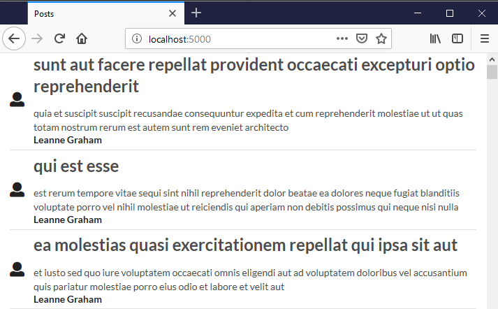

# Posts

This repo contains code for 2 posts apps written in 2 different languages.

The app itself shows posts from the https://jsonplaceholder.typicode.com/ REST API.

## Motivation

The React/Redux/Typescript app was created as part of a course learning React & Redux. Consequently the code in that project might not be of the highest quality.

I wanted to write the Elm version of the same thing to get more of a direct comparison between the 2 languages.